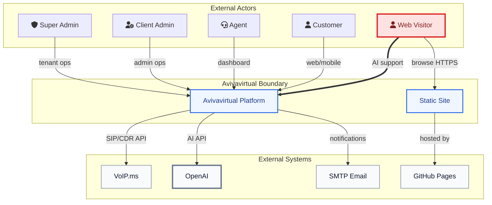
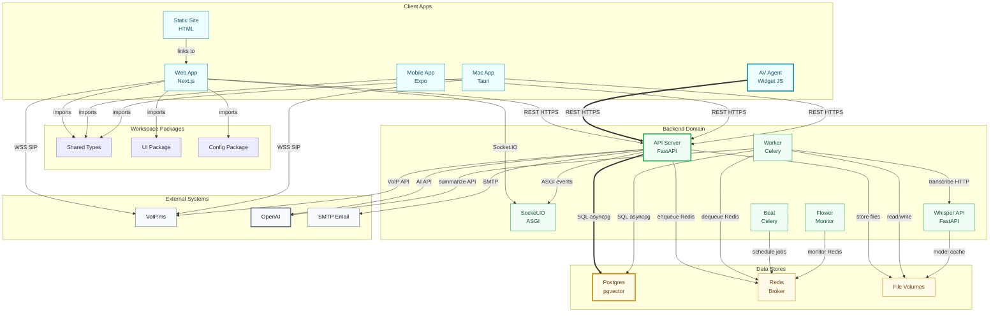
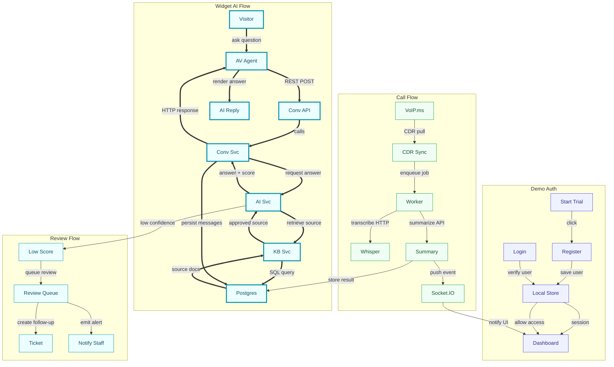

# Avivavirtual Platform

Avivavirtual is an AI-powered customer care platform for Canadian businesses. It combines public web pages, a protected operations dashboard, FastAPI backend services, VoIP.ms browser calling, post-call Whisper transcription, Expo mobile screens, and a Tauri macOS agent app.

The repository name remains `avivavirtual.github.io`, and the original static GitHub Pages files are still present at the root (`index.html`, `404.html`, `CNAME`, SEO and verification files). The SaaS platform source lives in `apps/`, `packages/`, `alembic/`, and root orchestration files.

## Monorepo

```text
apps/
  api/       FastAPI, SQLModel, Celery, Socket.IO
  web/       Next.js 14 App Router dashboard and public site
  mobile/    Expo customer and agent screens
  macos/     Tauri 2 + React agent desktop shell
  whisper/   self-hosted faster-whisper service
packages/
  shared/    shared TypeScript types and utilities
  ui/        small shared React components
  config/    shared config values
alembic/     root Alembic migrations
seed.py      demo seed script
```

## Architecture Diagrams

### System Context Diagram (C4 Level 1)

This context view shows the external people and systems around the Avivavirtual platform. The platform boundary contains the SaaS application and the preserved public static site. The red-highlighted path is the core customer-to-AI support path through the widget and platform.

```mermaid
flowchart TD
  %% Avivavirtual Detailed Architecture

  classDef user fill:#fff7ed,stroke:#f97316,stroke-width:2px,color:#7c2d12
  classDef frontend fill:#ecfeff,stroke:#0891b2,stroke-width:2px,color:#164e63
  classDef backend fill:#f0fdf4,stroke:#16a34a,stroke-width:2px,color:#14532d
  classDef data fill:#fefce8,stroke:#ca8a04,stroke-width:2px,color:#713f12
  classDef ai fill:#f5f3ff,stroke:#7c3aed,stroke-width:2px,color:#3b0764
  classDef external fill:#f8fafc,stroke:#64748b,stroke-width:2px,color:#0f172a
  classDef critical fill:#fee2e2,stroke:#dc2626,stroke-width:4px,color:#7f1d1d
  classDef async fill:#eff6ff,stroke:#2563eb,stroke-width:2px,color:#1e3a8a

  %% Users
  subgraph USERS["👥 External Users"]
    Visitor["🌐 Website Visitor"]
    Customer["🙋 Customer"]
    Agent["🎧 Support Agent"]
    ClientAdmin["🏢 Client Admin"]
    SuperAdmin["🛡️ Super Admin"]
  end

  %% Client Apps
  subgraph CLIENTS["📱 Client Applications"]
    StaticSite["🌍 Static GitHub Pages Site<br/>index.html / 404.html / CNAME"]
    WebApp["💻 Next.js 14 Web App<br/>Dashboard + Public SaaS UI"]
    Widget["💬 AI Chat Widget<br/>Embedded customer support"]
    Mobile["📱 Expo Mobile App<br/>Customer + Agent screens"]
    MacApp["🖥️ Tauri macOS App<br/>Agent desktop shell"]
  end

  %% Edge
  subgraph EDGE["🌎 Public Access Layer"]
    DNS["🌐 Domain / DNS<br/>avivavirtual.com"]
    HTTPS["🔒 HTTPS / Browser"]
  end

  %% API
  subgraph API["⚙️ FastAPI Backend"]
    FastAPI["🚀 FastAPI ASGI App<br/>REST API /api/v1"]
    SocketIO["🔴 Socket.IO Gateway<br/>Live chat + agent events"]
    Auth["🔐 Auth Module<br/>JWT + Refresh Tokens"]
    Tenant["🏢 Tenant Scope Middleware<br/>Org-level isolation"]
    Security["🧱 Security Headers<br/>CORS / HSTS / Frame Protection"]
    Routers["🧩 API Routers<br/>auth, users, orgs, conversations,<br/>tickets, AI, KB, analytics, files, VoIP"]
  end

  %% Services
  subgraph SERVICES["🧠 Backend Services"]
    AuthSvc["🔐 Auth Service"]
    ConvSvc["💬 Conversation Service"]
    TicketSvc["🎫 Ticket Service"]
    AISvc["🤖 AI Service"]
    KBSvc["📚 Knowledge Base Service"]
    VoIPSvc["☎️ VoIP Service"]
    AnalyticsSvc["📊 Analytics Service"]
    AuditSvc["🧾 Audit Service"]
    NotifySvc["📨 Notification Service"]
  end

  %% Async
  subgraph ASYNC["⏱️ Async Processing"]
    Redis["🧰 Redis<br/>Broker + cache"]
    CeleryWorker["👷 Celery Worker<br/>transcription, summary, embeddings"]
    CeleryBeat["⏰ Celery Beat<br/>scheduled jobs"]
    Flower["🌸 Flower<br/>worker monitoring"]
  end

  %% Data
  subgraph DATA["🗄️ Persistence Layer"]
    Postgres["🐘 PostgreSQL + pgvector<br/>tenants, users, tickets, messages,<br/>embeddings, audit logs"]
    Uploads["📁 Upload Volume<br/>attachments"]
    Recordings["🎙️ Recording Volume<br/>call recordings"]
    Alembic["🧬 Alembic Migrations<br/>schema versioning"]
  end

  %% AI/Voice
  subgraph INTELLIGENCE["🤖 AI + Voice Processing"]
    OpenAI["🧠 OpenAI API<br/>chat + embeddings"]
    Whisper["🎧 Whisper Service<br/>faster-whisper transcription"]
  end

  %% External systems
  subgraph EXTERNAL["🔌 External Providers"]
    VoIPMS["☎️ VoIP.ms<br/>SIP / WebRTC / CDR"]
    SMTP["📧 SMTP / Brevo<br/>emails + alerts"]
    GitHubPages["📄 GitHub Pages<br/>static hosting"]
  end

  %% Shared packages
  subgraph PACKAGES["📦 Shared Monorepo Packages"]
    Shared["🧩 packages/shared<br/>TypeScript types"]
    UI["🎨 packages/ui<br/>React components"]
    Config["⚙️ packages/config<br/>shared config"]
  end

  %% User flows
  Visitor --> DNS --> HTTPS --> StaticSite
  Visitor --> Widget
  Customer --> WebApp
  Customer --> Mobile
  Agent --> WebApp
  Agent --> MacApp
  ClientAdmin --> WebApp
  SuperAdmin --> WebApp

  %% Hosting
  StaticSite --> GitHubPages
  StaticSite --> WebApp

  %% Frontend to backend
  WebApp -->|"REST HTTPS"| FastAPI
  WebApp -->|"Socket.IO realtime"| SocketIO
  Widget ==>|"Public widget API"| FastAPI
  Mobile -->|"REST HTTPS"| FastAPI
  MacApp -->|"REST HTTPS"| FastAPI

  %% WebRTC
  WebApp -->|"WSS SIP calling"| VoIPMS
  MacApp -->|"WSS SIP calling"| VoIPMS

  %% API internals
  FastAPI --> Security
  FastAPI --> Auth
  FastAPI --> Tenant
  FastAPI --> Routers
  FastAPI --> SocketIO

  Routers --> AuthSvc
  Routers --> ConvSvc
  Routers --> TicketSvc
  Routers --> AISvc
  Routers --> KBSvc
  Routers --> VoIPSvc
  Routers --> AnalyticsSvc
  Routers --> AuditSvc
  Routers --> NotifySvc

  %% Service dependencies
  AuthSvc --> Postgres
  ConvSvc --> Postgres
  TicketSvc --> Postgres
  KBSvc --> Postgres
  AISvc --> OpenAI
  AISvc --> KBSvc
  VoIPSvc --> VoIPMS
  AnalyticsSvc --> Postgres
  AuditSvc --> Postgres
  NotifySvc --> SMTP

  %% Async jobs
  FastAPI -->|"enqueue jobs"| Redis
  Redis --> CeleryWorker
  CeleryBeat --> Redis
  Flower --> Redis

  CeleryWorker --> Postgres
  CeleryWorker --> Uploads
  CeleryWorker --> Recordings
  CeleryWorker --> Whisper
  CeleryWorker --> OpenAI

  %% Storage
  FastAPI --> Uploads
  FastAPI --> Recordings
  FastAPI --> Postgres
  Alembic --> Postgres

  %% Shared packages
  WebApp --> Shared
  WebApp --> UI
  WebApp --> Config
  Mobile --> Shared
  MacApp --> Shared

  %% Highlight critical path
  Widget ==>|"1. customer asks question"| FastAPI
  FastAPI ==>|"2. route to conversation service"| ConvSvc
  ConvSvc ==>|"3. retrieve KB context"| KBSvc
  KBSvc ==>|"4. vector search"| Postgres
  ConvSvc ==>|"5. generate AI answer"| AISvc
  AISvc ==>|"6. LLM response"| OpenAI
  ConvSvc ==>|"7. realtime update"| SocketIO
  SocketIO ==>|"8. response to visitor/agent"| Widget

  class Visitor,Customer,Agent,ClientAdmin,SuperAdmin user
  class StaticSite,WebApp,Widget,Mobile,MacApp frontend
  class FastAPI,SocketIO,Auth,Tenant,Security,Routers,AuthSvc,ConvSvc,TicketSvc,AISvc,KBSvc,VoIPSvc,AnalyticsSvc,AuditSvc,NotifySvc backend
  class Redis,CeleryWorker,CeleryBeat,Flower async
  class Postgres,Uploads,Recordings,Alembic data
  class OpenAI,Whisper ai
  class VoIPMS,SMTP,GitHubPages,DNS,HTTPS external
  class Widget,FastAPI,ConvSvc,KBSvc,AISvc,Postgres,OpenAI,SocketIO critical
```




### Container Diagram (C4 Level 2)

This container view breaks the monorepo into deployable apps, shared packages, backend services, data stores, and external integrations. Client apps talk to the FastAPI backend over REST and Socket.IO, while browser calling uses VoIP.ms WebRTC/SIP. Celery workers process async jobs through Redis and persist results in PostgreSQL.



### Component Diagram (C4 Level 3)

This component view drills into the FastAPI backend, which is the most critical container. Routers expose HTTP APIs, services enforce business logic and tenant scope, models/schemas define persistence contracts, and Celery tasks run async workloads. The red path highlights the widget AI-answer path from conversation routing to knowledge-base retrieval and response generation.

```mermaid
flowchart TD
  classDef critical fill:#fee2e2,stroke:#dc2626,stroke-width:3px,color:#7f1d1d
  classDef component fill:#f0f9ff,stroke:#0284c7,color:#0c4a6e
  classDef infra fill:#f8fafc,stroke:#64748b,color:#0f172a

  subgraph Entry["Entry Layer"]
    Main["Main App"]
    AuthMW["Auth MW"]
    TenantMW["Tenant MW"]
    SocketGW["Socket GW"]
  end

  subgraph Auth["Auth Domain"]
    AuthRouter["Auth Router"]
    UserRouter["User Router"]
    OrgRouter["Org Router"]
    AuthSvc["Auth Svc"]
    UserSvc["User Svc"]
    OrgSvc["Org Svc"]
  end

  subgraph Support["Support Domain"]
    ConvRouter["Conv Router"]
    MsgRouter["Msg Router"]
    TicketRouter["Ticket Router"]
    ConvSvc["Conv Svc"]
    TicketSvc["Ticket Svc"]
    NotifySvc["Notify Svc"]
  end

  subgraph AI["AI Domain"]
    AIRouter["AI Router"]
    KBRouter["KB Router"]
    AISvc["AI Svc"]
    KBSvc["KB Svc"]
  end

  subgraph Ops["Ops Domain"]
    VoIPRouter["VoIP Router"]
    AnalyticsRouter["Analytics Router"]
    AuditRouter["Audit Router"]
    VoIPSvc["VoIP Svc"]
    AuditSvc["Audit Svc"]
    AnalyticsSvc["Analytics Svc"]
  end

  subgraph Async["Async Jobs"]
    CeleryApp["Celery App"]
    CDRTask["CDR Task"]
    SLATask["SLA Task"]
    EmbedTask["Embed Task"]
    TranscribeTask["Transcribe Task"]
    SummaryTask["Summary Task"]
    RetainTask["Retain Task"]
  end

  subgraph Persistence["Persistence"]
    Models["SQL Models"]
    Schemas["Schemas"]
    DB["Postgres"]
    Queue["Redis"]
  end

  Main -->|mounts| AuthRouter
  Main -->|mounts| ConvRouter
  Main -->|mounts| TicketRouter
  Main -->|mounts| AIRouter
  Main -->|mounts| KBRouter
  Main -->|mounts| VoIPRouter
  Main -->|mounts| AnalyticsRouter
  Main -->|mounts| AuditRouter
  Main -->|wraps| AuthMW
  Main -->|wraps| TenantMW
  Main -->|serves| SocketGW
  AuthRouter -->|calls| AuthSvc
  UserRouter -->|calls| UserSvc
  OrgRouter -->|calls| OrgSvc
  ConvRouter ==>|calls| ConvSvc
  MsgRouter -->|calls| ConvSvc
  TicketRouter -->|calls| TicketSvc
  AIRouter -->|calls| AISvc
  KBRouter ==>|calls| KBSvc
  ConvSvc ==>|answers via| AISvc
  AISvc ==>|reads source| KBSvc
  ConvSvc -->|notifies| NotifySvc
  ConvSvc -->|emits| SocketGW
  VoIPRouter -->|calls| VoIPSvc
  AnalyticsRouter -->|calls| AnalyticsSvc
  AuditRouter -->|calls| AuditSvc
  AuthSvc -->|uses| Models
  ConvSvc -->|uses| Models
  TicketSvc -->|uses| Models
  AISvc -->|uses| Models
  KBSvc -->|uses| Models
  Models ==>|SQL| DB
  Schemas -->|validate| AuthRouter
  Schemas -->|validate| ConvRouter
  CeleryApp -->|uses| Queue
  CeleryApp -->|runs| CDRTask
  CeleryApp -->|runs| SLATask
  CeleryApp -->|runs| EmbedTask
  CeleryApp -->|runs| TranscribeTask
  CeleryApp -->|runs| SummaryTask
  CeleryApp -->|runs| RetainTask
  CDRTask -->|persists| DB
  SLATask -->|persists| DB
  EmbedTask -->|updates| DB
  TranscribeTask -->|updates| DB
  SummaryTask -->|updates| DB
  RetainTask -->|purges| DB

  class ConvRouter,ConvSvc,AISvc,KBSvc,DB critical
  class Main,AuthRouter,UserRouter,OrgRouter,ConvRouter,MsgRouter,TicketRouter,AIRouter,KBRouter,VoIPRouter,AnalyticsRouter,AuditRouter component
  class AuthSvc,UserSvc,OrgSvc,ConvSvc,TicketSvc,NotifySvc,AISvc,KBSvc,VoIPSvc,AuditSvc,AnalyticsSvc component
  class Models,Schemas,DB,Queue,CeleryApp,SocketGW,AuthMW,TenantMW infra
```



### Data Flow Diagram

This data-flow view traces the main demo and production journeys: demo registration/login, widget-to-AI answer generation, low-confidence review routing, and call transcription. The critical path is the widget AI answer flow, from visitor message through the backend, knowledge base, AI service, and back to the widget.



## Architecture Summary

- Core patterns: monorepo with multiple client apps, API-centered service layer, repository-style SQLModel persistence, event-driven async jobs through Celery/Redis, and widget-first AI support.
- Scalability: Next.js web, FastAPI API, Celery workers, Redis, PostgreSQL, and Whisper can scale independently. Worker queues can be split by transcription, summarization, embeddings, and SLA workloads.
- Potential SPOFs: single PostgreSQL instance, single Redis broker, single API instance, local file volumes for recordings/uploads, and external dependency availability for VoIP.ms/OpenAI/SMTP.
- Suggested improvements: add managed Postgres replicas/backups, Redis HA, object storage for recordings, API autoscaling, queue-specific workers, health checks with alerting, and production auth backed by server-side sessions or JWT refresh rotation.

## Quick Start

1. Copy environment values:

```bash
cp .env.example .env
```

2. Start infrastructure and services:

```bash
docker compose up --build
```

3. Create a local Python virtual environment and install API dependencies.

Use Python 3.11 or 3.12 for local development. On macOS, `python` and `pip` are often not installed as commands, so use `python3.12 -m ...` or `python3 -m ...`.

```bash
python3.12 -m venv .venv
.venv/bin/python -m pip install --upgrade pip
.venv/bin/python -m pip install -r apps/api/requirements.txt
```

4. Apply migrations and seed demo data:

```bash
.venv/bin/python -m alembic -c alembic.ini upgrade head
.venv/bin/python seed.py
```

Demo accounts:

| Role | Email | Password |
|---|---|---|
| Super admin | `admin@avivavirtual.ca` | `SuperAdmin@123!` |
| Client admin | `manager@demobusiness.ca` | `ClientAdmin@123!` |
| Agent | `agent1@demobusiness.ca` | `Agent@123!` |
| Agent | `agent2@demobusiness.ca` | `Agent@123!` |

## Local Development

API:

```bash
cd apps/api
../../.venv/bin/python -m uvicorn main:socket_app --reload --host 0.0.0.0 --port 3001
```

If you have not created the virtual environment yet, run this once from the repository root:

```bash
python3.12 -m venv .venv
.venv/bin/python -m pip install --upgrade pip
.venv/bin/python -m pip install -r apps/api/requirements.txt
```

Web:

```bash
npm install --workspaces --include-workspace-root
npm run dev --workspace=apps/web
```

Mobile:

```bash
npm run dev --workspace=apps/mobile
```

macOS shell:

```bash
npm run dev --workspace=apps/macos
```

Whisper:

```bash
cd apps/whisper
cp .env.example .env
docker compose up --build
```

## Backend

The backend uses FastAPI 0.109, SQLModel, PostgreSQL 15 with pgvector, Redis, Celery, python-socketio, JWT auth, VoIP.ms wrappers, OpenAI/Whisper integration, and PIPEDA-focused retention jobs.

Core routes are mounted under `/api/v1`:

- `/auth`, `/users`, `/organizations`
- `/conversations`, `/messages`, `/tickets`
- `/knowledge-base`, `/ai`, `/analytics`
- `/audit-logs`, `/notifications`, `/files`
- `/voip`, `/billing`

Tenant isolation is enforced in protected services by filtering organization-scoped queries with `organization_id`.

### RAG Retrieval

The AI chat path uses deterministic multi-hop retrieval before answering from approved knowledge-base content:

- Query decomposition keeps the original question and splits obvious multi-intent questions into subqueries.
- Retrieval fuses per-subquery matches from embedding chunks when available, with article-content fallback when the embedding index is empty or partial.
- Context-window-aware augmentation packs retrieved chunks under `RAG_CONTEXT_WINDOW_TOKENS`, `RAG_RESPONSE_TOKEN_BUDGET`, and `RAG_MAX_CONTEXT_TOKENS`.
- Explicit no-results handling returns `retrieval_status="NO_RESULTS"` and sets `handoff_reason="NO_RESULTS"` instead of treating missing sources as low confidence.
- Retrieval SPOF mitigation is intentionally local: if Celery/embedding indexing lags, chat still searches approved article content and exposes a `retrieval_warnings` value.

Kaggle datasource experimentation is available through `POST /api/v1/knowledge-base/experiments/kaggle/upload` with a CSV upload. The typo-compatible `/experiments/keggle/upload` alias maps to the same importer. Imported rows are tagged with `source_type="kaggle"` plus `source_name`, `source_uri`, and `source_metadata`.

## VoIP.ms Configuration

1. Log in to VoIP.ms, open API Settings, and enable API access.
2. Restrict allowed IPs to the production server IP. For local development, use a temporary broad rule only while testing.
3. Manage your DID and route it to a main sub-account, ring group, or hunt group.
4. Confirm WebRTC is enabled for the account.
5. Enable PCMU, PCMA, and OPUS codecs.
6. Use `toronto.voip.ms` as the recommended SIP server for Ontario users.
7. Browser SIP clients connect with `wss://webrtc.voip.ms:8443`.

Agent sub-accounts are created by the API when an admin creates a user with role `AGENT`. SIP passwords are encrypted at rest with AES-GCM using `ENCRYPTION_KEY`.

PIPEDA note: VoIP.ms is a Canadian provider based in Montreal, QC. For clients with Canadian data residency requirements, pair VoIP.ms with the self-hosted Whisper service deployed in a Canadian region such as DigitalOcean Toronto (`tor1`).

Limitations:

- CDRs are synced by Celery beat every 60 minutes.
- IVR/ring-group routing is configured in the VoIP.ms dashboard.
- Transcription is post-call, not real-time.
- Agents must grant microphone permission before browser SIP registration.

## Whisper Pipeline

Call flow:

```text
VoIP.ms CDR sync -> download MP3 -> Whisper transcription -> GPT summary -> WebSocket notification
```

Set `WHISPER_PROVIDER=openai` for OpenAI Whisper API or `WHISPER_PROVIDER=self-hosted` for `apps/whisper`.

Default retention:

- Recordings: 90 days
- Transcripts and summaries: 365 days

## Static Website

The original GitHub Pages files remain at the repository root:

- `index.html`
- `404.html`
- `CNAME`
- `robots.txt`
- `sitemap.xml`
- `SEO_GUIDE.md`

These are preserved for the existing `avivavirtual.com` deployment while the platform app can be deployed separately, for example at `app.avivavirtual.ca`.
