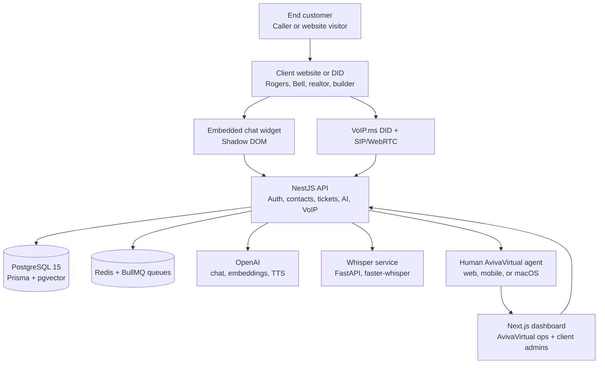
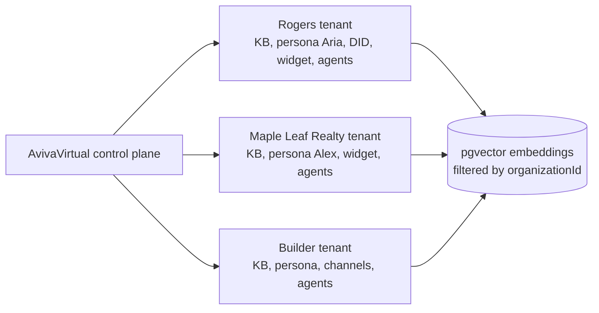
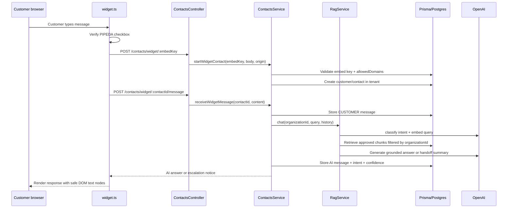
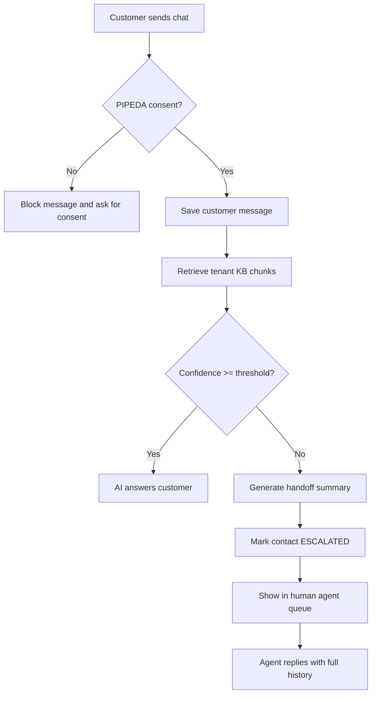
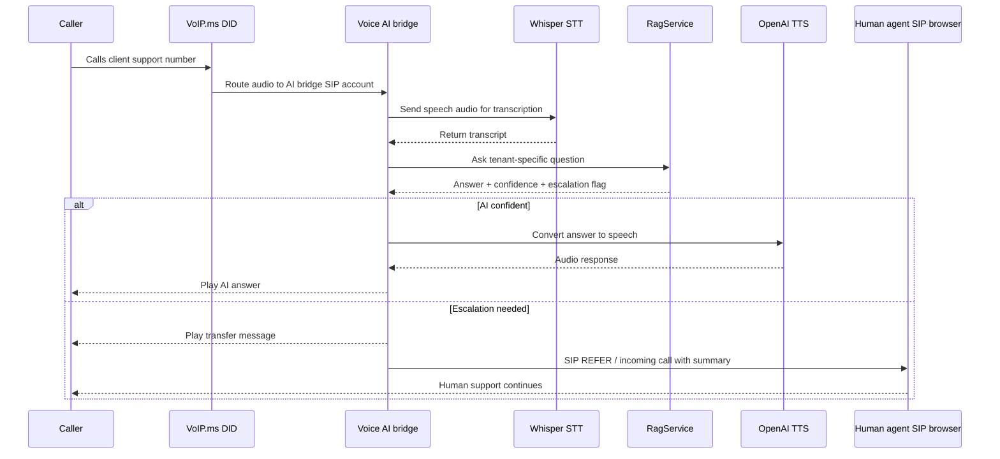
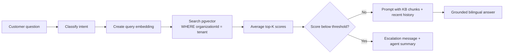
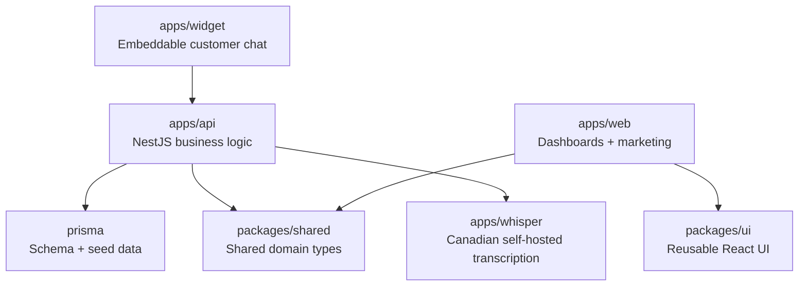

# AvivaVirtual Platform Architecture

This document explains the platform in plain language first, then shows the code and customer-contact flows with Mermaid diagrams.

## Plain-language summary

AvivaVirtual runs customer support on behalf of many client companies. A Rogers customer, for example, may call or chat with what looks like Rogers support, but AvivaVirtual's platform answers first with a Rogers-trained AI agent. If the AI is unsure, it passes the customer, the conversation history, and a short summary to a human AvivaVirtual agent assigned to Rogers.

The most important rule is tenant isolation: each client has its own knowledge base, AI personality, channels, agents, analytics, tickets, and branding. A Rogers answer must never use Maple Leaf Realty data.

## 1. Whole-platform architecture

## 2. Tenant isolation model

Every database query that touches customer, contact, ticket, KB, embedding, or call-record data must include the tenant's `organizationId` unless the caller is a permitted AvivaVirtual cross-client role.

## 3. Code flow for a widget message

## 4. Chat escalation flow

## 5. Voice flow

## 6. RAG decision flow

## 7. What each app owns

